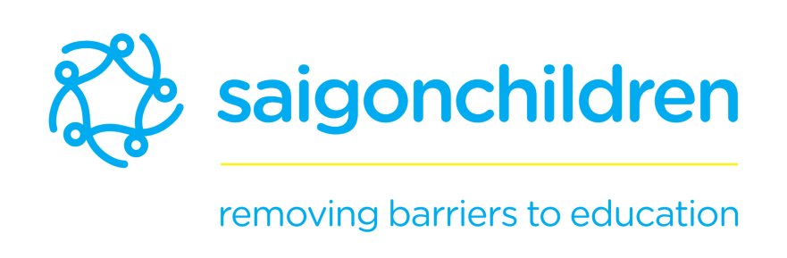
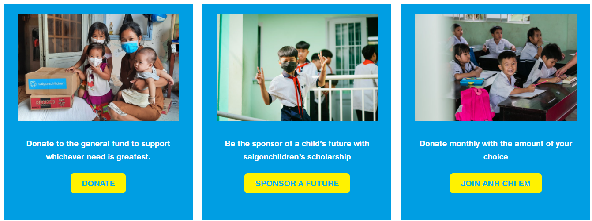
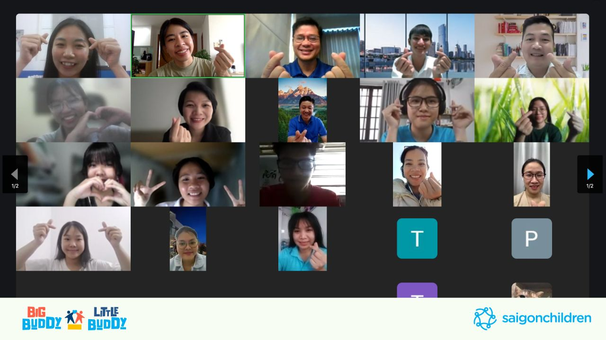

#### Welcome to the Saigonchildren Documentation 

  

### About us
[Saigon Children's Charity CIO (saigonchildren)](https://www.saigonchildren.com/) was founded in 1992 to help disadvantaged children get an education and a fairer start in life. Saigonchildren works exclusively across the whole of Vietnam to overcome barriers to education for children, including poverty, geography, knowledge, and disability.

### About the project
Mentoring project Big Buddy, Little Buddy (BBLB) or Mentor-To-Mentee (M2M) is a program aiming to provide holistic development for saigonchildren's scholarship recipients, the BBLB initiative serves as a bridge connecting generations between our students, the 'little buddies,' and 'big buddies,' who are our scholarship alumni, corporate partners, and staff, all dedicated to nurturing future leaders.

### Guidelines to contribute

Below is the list of guidelines and documentation for the project:

- [Software Requirement Specification](./software_requirement_specification.md)
A detailed document that outlines the software requirements for the project.

- [Development Guidelines](./development_guidelines.md) 
A comprehensive guide for developers to follow when working on the project.

- [API Documentation](./api_documentation.md)
A detailed guide on how to use the API endpoints.

- [Contact Information](./contact.md)
A list of contact information for the project team.