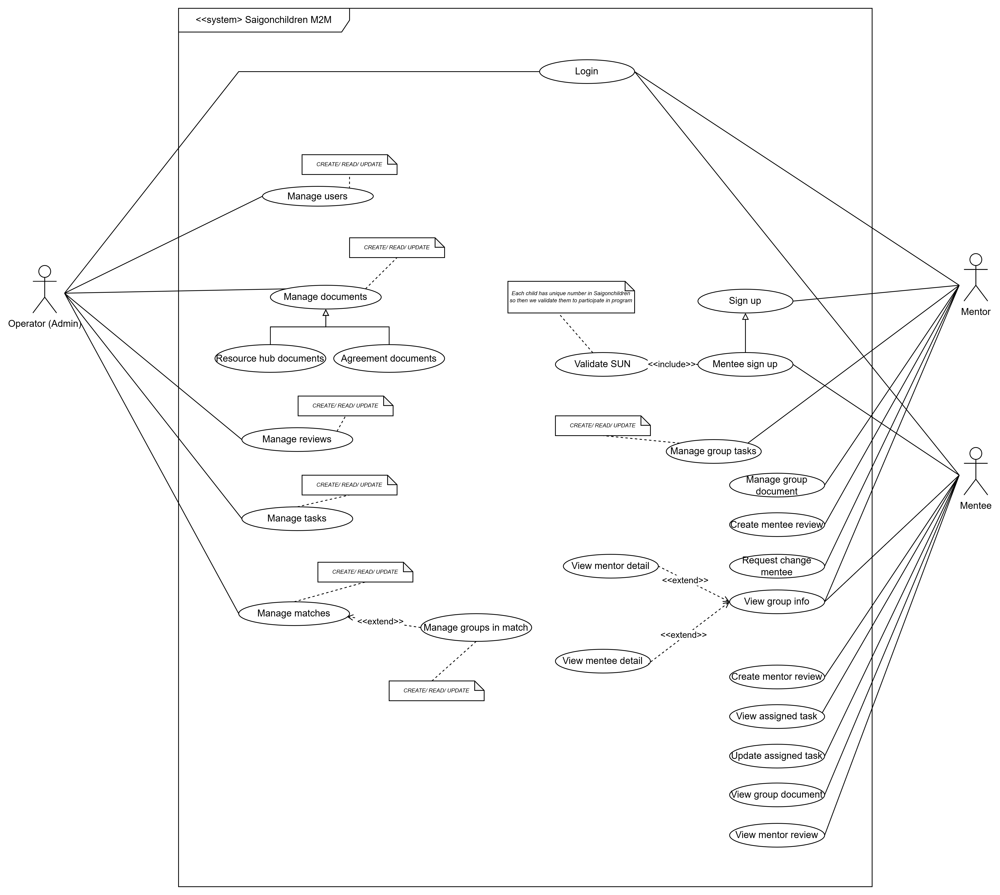

#### Software Requirement Specification

# 1. Introduction

The Mentor-Mentee Management System aims to facilitate structured mentorship by connecting mentors and mentees, enabling communication,
automating matching process, session scheduling, progress tracking, and administrative oversight for the program.

# 2. Scope

## 2.1. Scope of the project

- Admin Site: Saigonchildren staff (Admin) can manage users, mentors, mentees, sessions, and program settings.
- Portal for mentors and mentees: Users can view their profile, mentor/mentee profile, and session history.

## 2.2. Overview of the system

We have three main user roles in the system are `Admin`, `Mentor`, and `Mentee`.

Admin can manage users, mentors, mentees, sessions, and program settings. The Admin can make `CRUD` operations on the following entities: `Users` (Mentors and Mentees), `Matches` includes `Mentor-Mentee` pairs or `Group`, `Documents`.

Admin can create matching rules for mentors and mentees. Then admin can run the matching algorithm to match mentors and mentees based on the rules.

### 2.2.1 Matching in the system

The program is seasonal, and each season has a start date and an end date. After the season end, the account of mentors and mentees will be prevented from matching system (the user will be notified). The Admin can create a new season and continue the program. If the user wants to join the program, they need to register for the new season by updating their profile to make a request to join the program.

In one program season, `One mentor can be matched with many mentees`. `One mentee can be matched with one mentor`. We call a `Group` is a collection of one mentor and many mentees.

A `Match` is a collection of many groups.

# 3. Functional requirements

## 3.1 Core features

Below are the core features of the system:

## 3.2 User interaction & System workflow

We have three main user roles in the system are `Admin`, `Mentor`, and `Mentee`.

Below is the use case diagram for the system:

## 3.3 Core workflows

Business processes in the system:

### 3.3.1 Mentee authentication flow

### 3.3.2 Mentor authentication flow

- Mentor registers an account then the mentor will be approved by the Admin. The mentor will be notified by email when the account is approved. The mentor can log in to the system with some other page approved by the Admin.

### 3.3.3 Admin authentication flow

### 3.3.4 Matching flow

In the matching flow we have two main steps: `Create matching rules` and `Run matching algorithm`.

After that admin need to accept the mentee 

### 3.3.4 Group documents 

We have two type of documents for a group: Resources and agreements.

Resource hub flow for mentor in a group: 

Agreement flow for mentor in a group:

### 3.3.5 Group tasks

### 3.3.6 Admin manage users

- Admin manages users.

### 3.3.7 Admin manage matches 

- Admin manages matches.

# 4. System architecture & Design

# 4.1 Class Diagram

As above use case diagram, we have three main components in the system are `Admin`, `Mentor`, and `Mentee`. Below is the class diagram for the system:

# 4.2 Database design

For the best performance, we use MySQL as the database for the system. We use Physical Data Model to design the database schema.

# 4.3. Matching algorithm design

I am working on the design of the matching algorithm here: [Matching Algorithm Design]()

# 4.4. User interface design

Our team is working on the design of the user interface here: [Figma]()

# 4.5. Technologies

- **Backend**: FastAPI, SQLAlchemy, MySQL, Alembic, Pydantic, JWT, Docker, Docker Compose
- **Frontend**: React, Zustand, Axios, AntD
- **CI/CD**: Github Actions

# 5. Non-functional requirements

## 5.1. Performance

- The system should be able to handle 100 concurrent users.
- The system should be able to handle 100 requests per second.
- The system should be able to handle 1000 users.
- The system should be able to handle 1000 sessions.

## 5.2. Security

- The system should use JWT for authentication.
- The system should use HTTPS for all requests.
- The system should use CORS to prevent unauthorized requests.

## 5.3. Availability

- The system should have an uptime of 99.9%.

# 6. Testing Requirements

- The system should have unit tests for all components.
- The system should have integration tests for all components.
- The system should have end-to-end tests for all components.
- The system should have performance tests for all components.

I will update soon.

# 7. Project timeline

| Phase | Start date | End date (Expect) |
| --- | --- | --- |
| Requirement gathering | 08/08/2024 | 30/11/2024 |
| Design and prototyping | 30/11/2024 | 10/02/2025 |
| Development | 08/02/2025 | 08/05/2025 |
| Testing | 10/05/2025 | 10/05/2025 |
| Deployment | 11/05/2025 | 11/06/2025 |

# 8. Revisions

| Version | Date | Description |
| --- | --- | --- |
| 0.0.1 | 12/02/2025 | Init documentation |
|  |  |  |

# 9. Appendices

# 9.1 Glossary

- Admin: Saigonchildren staff who manages the system.
- CRUD: Create, Read, Update, Delete operations.

# 10. Signatures

- Project owner: Saigonchildren

- Author: Tran Cong Toan - tctoan1024@gmail.com